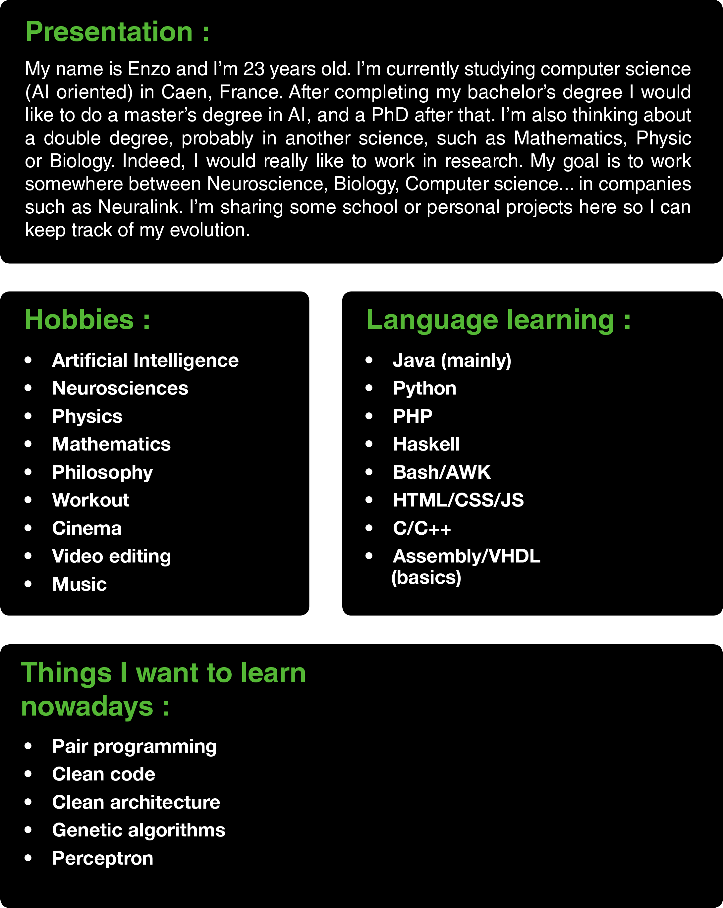

# Welcome !

## Biography 

<!-- 

 -->

### Presentation :

>My name is Enzo and I'm 23 years old. I'm currently studying computer science (AI oriented) in Caen, France. After completing my bachelor's degree I would like to do a master's degree in AI, and a PhD after that. I'm also thinking about a double degree, probably in another science, such as Mathematics, Physic or Biology. Indeed, I would really like to work in research. My goal is to work somewhere between Neuroscience, Biology, Computer science ... in companies such as Neuralink. I'm sharing some school or personal projects here so I can keep track of my evolution.

### Hobbies :

- Artificial Intelligence
- Neurosciences
- Physics
- Mathematics
- Workout
- Cinema
- Video editing
- Music

## Skills

### Languages learning :

- ***** Java
- **** PHP        
- **** Haskell 
- *** Python 
- *** Bash/AWK 
- *** HTML/CSS/JS 
- *** C/C++ 
- ** Assembly/VHDL 

### Things I want to learn nowadays :

- Pair programming
- Clean code
- Clean architecture
- Genetic algorithms
- Neural networks

## Statistics 

## Links 

- mail : enzodurandcontact@gmail.com
-  
- quora : [hanzo](https://fr.quora.com/profile/Hanzo?ch=10&share=519cf10b&srid=YhyTm) 

## Visitor count  

