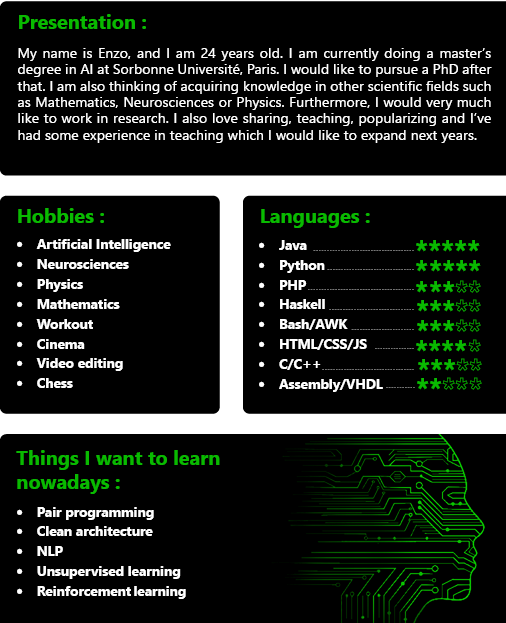

<h1 align="center" style="color:#000; font-family: 'Segoe UI'; font-size: 4em;">Welcome !</h1>

## Biography 

## Statistics 

## Links 

- Website : [Resume & Porfolio](https://hanzopgp.github.io/CVPortfolioWeb/)
- Portfolio : [ProjectList](https://hanzopgp.github.io/ProjectList/)
- Hobbies : [ScienceLinks](https://github.com/hanzopgp/ScienceLinks/blob/master/README.md)
- Mail : [enzodurandcontact@gmail.com](mailto:enzodurandcontact@gmail.com)
- Discord : [Hanzo#8840](https://discordapp.com/users/339384664118657034/)
- Quora : [hanzo](https://fr.quora.com/profile/Hanzo?ch=10&share=519cf10b&srid=YhyTm) 
- Linkedin : [Enzo Durand](https://www.linkedin.com/in/enzo-durand-494700204/)
- GitLab : [hanzopgp](https://gitlab.com/hanzopgp)
- Kaggle : [Enzo Durand](https://www.kaggle.com/enzodurand)

## Visitor count  

